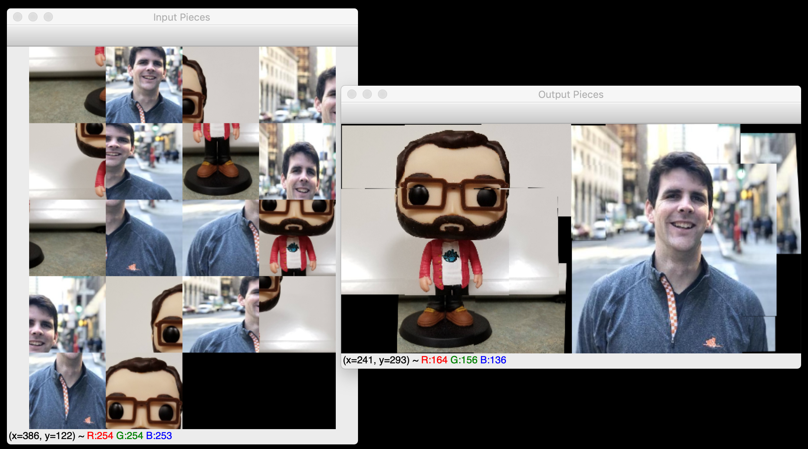

# Stitcher

Experiment to stitch images together without directional assumptions.  Takes a list of images as input and reduces list by iteratively stitching images together.  Process stops if images not deemed similiar enough (as deemed by an arbitrarily set keypoint match count).

A lot of the starting code in this repo was based on [@PyImageSearch](https://twitter.com/PyImageSearch)'s tutorial, [OpenCV panorama stitching](https://www.pyimagesearch.com/2016/01/11/opencv-panorama-stitching/).

## Example

### Input


```
python stitch.py -i image_pieces
```

<sub>\**[`image_pieces`](image_pieces) is a directory containing images to be stitched*</sub>


### Output

#### Final output compared to input pieces



#### Optional progress display


<sub>\**Funko Pop style picture provided by [@pofigster](https://twitter.com/pofigster)*</sub>
